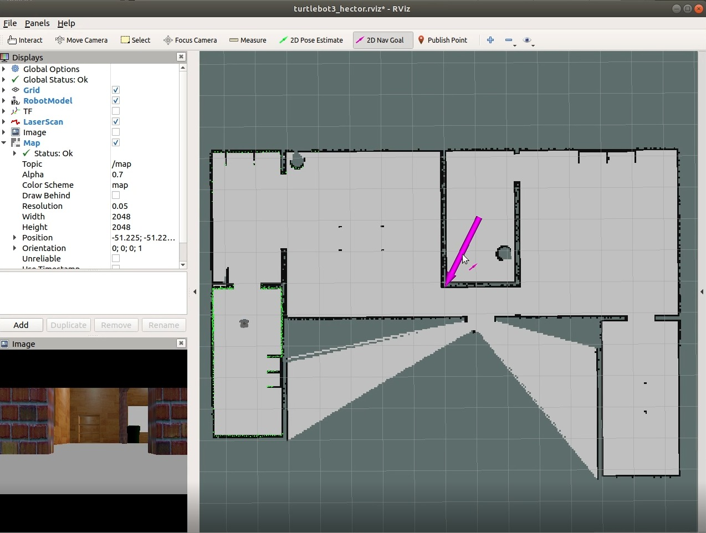
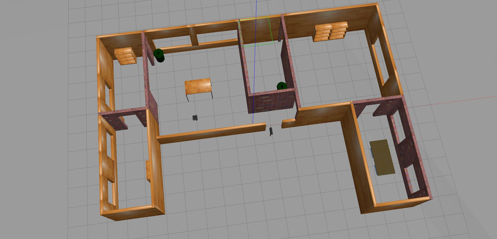

# AstarProject3D
## Description

ROS implementation for global and local planner. Global planner based on A*. 


## Video example
[](https://youtu.be/u_siL7xBXnY)


## Dependencies

The following python package are required:

- python 2.*
- numpy
- Tested in ROS melodic, Ubuntu 18.04

## Setup

1. For our tested environment, robot and map representation (Optional):
- Hector SLAM:
```sh
    $ cd ~/#your-catkin-workspace#/src/
    $ git clone https://github.com/tu-darmstadt-ros-pkg/hector_slam.git
```

- Turtlebot:
```sh
    $ cd ~/#your-catkin-workspace#/src/
    $ git clone https://github.com/ROBOTIS-GIT/turtlebot3.git
```

- Turtlebot simulation:
```sh
    $ cd ~/#your-catkin-workspace#/src/
    $ git clone -b melodic-devel https://github.com/ROBOTIS-GIT/turtlebot3_simulations.git    
```

2. Download and build repository:
```sh
    $ cd ~/#your-catkin-workspace#/src/
    $ git clone https://github.com/elbazam/AstarProject3D.git
    $ cd ~/#your-catkin-workspace# && catkin_make
```

## Execution

### Environment 1 - demo world


Run the following commands:
- Launch world and robot:
    ```sh
    $ export TURTLEBOT3_MODEL=waffle
    $ roslaunch turtlebot3_gazebo turtlebot3_world.launch
    ```
- Launch SLAM algorithm:
    ```sh
    $ export TURTLEBOT3_MODEL=waffle
    $ roslaunch turtlebot3_slam turtlebot3_slam.launch slam_methods:=hector
    ```
- Main code:
    ```sh
    $ rosrun astarproj main.py
    ```
- Use "2d nav goal" in rviz (purple color located in the upper area) to determine your goal (location and orientation).An example:


### environment 2 - house world



Run the following commands:
- Launch world and robot:
    ```sh
    $ export TURTLEBOT3_MODEL=waffle
    $ roslaunch turtlebot3_gazebo turtlebot3_house.launch
    ```
    
- Launch SLAM algorithm:
    ```sh
    $ export TURTLEBOT3_MODEL=waffle
    $ roslaunch turtlebot3_slam turtlebot3_slam.launch slam_methods:=hector
    ```
    
- Main code:
    ```sh
    $ rosrun astarproj second_map_main.py
    ```
    
- Follow environment 1 example


### For other environment:

- Launch environment.
- Launch occupancy grid based SLAM (a must).
- Main code:
    ```sh
    $ rosrun astarproj main.py
    ```
    
- Follow environment 1 example


## Messages

The messages and topics we use are:
 - PoseStamped - '/move_base_simple/goal' - Subscriber -  Getting the goal point and orientation from rviz
 - OccupancyGrid - '/map' - Subscriber - Getting 2D occupancy grid map data and its resolution
 - Odometry - '/odom' - Subscriber - Getting the robot real world location
 - Twist - '/cmd_vel' - Publisher - Robot velocity


## Contacting

For any questions, my contact email:
aoosha@gmail.com


