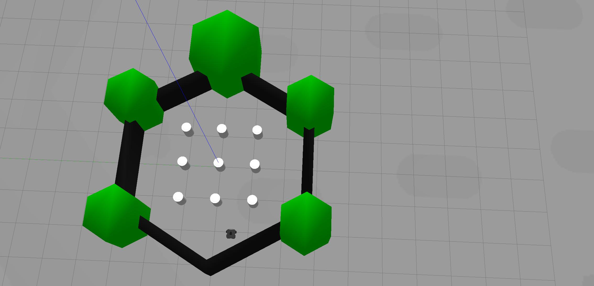

# AstarProject3D
## Description

This melodic ROS 1 package consist of 2 parts.

- A* 3D global path planing
- Simple basic local planner

## Requirments

- Download hector_slam or any other SLAM based package which generate OccupancyGrid ROS msg. In this project we used hector_slam package. See http://wiki.ros.org/hector_slam for documantation.
- For the robot and environments we used turtlebot3 package. If you want to download hector_slam and turtlebot3 environment:
    ```sh
    $ cd ~/catkin_ws/src/
    $ git clone -b melodic-devel https://github.com/ROBOTIS-GIT/turtlebot3_simulations.git
    $ git clone https://github.com/tu-darmstadt-ros-pkg/hector_slam.git
    $ git clone https://github.com/ROBOTIS-GIT/turtlebot3.git
    ```
- To download our code:
    ```sh
    $ cd ~/catkin_ws/src/
    $ git clone https://github.com/elbazam/AstarProject3D.git
    ```
- All the code here require catkin_make:
    ```sh
    $ cd ~/catkin_ws && catkin_make
    ```

## Messages

The messages and topics we use are:
 - PoseStamped - '/move_base_simple/goal' - Subscriber -  Getting the goal point and orientation from rviz
 - OccupancyGrid - '/map' - Subscriber - Getting 2D occupancy grid map data and its resolution
 - Odometry - '/odom' - Subscriber - Getting the robot real world location
 - Twist - '/cmd_vel' - Publisher - Robot velocity


## Activation

There are 2 environments for this code:

### environment 1 - demo world




Follow the following codes in order to activate:
- In the first terminal
    ```sh
    $ export TURTLEBOT3_MODEL=waffle
    $ roslaunch turtlebot3_gazebo turtlebot3_world.launch
    ```
- In the second terminal
    ```sh
    $ export TURTLEBOT3_MODEL=waffle
    $ roslaunch turtlebot3_slam turtlebot3_slam.launch slam_methods:=hector
    ```
- In the third terminal, use rqt or other way to publish cmd_vel in order to map the room
    ```sh
    $ rqt
    ```

- In the fourth terminal, run the main code:
    ```sh
    $ rosrun astarproj main.py
    ```
- Wait for the obsticle configuration space to be generated. You will get the message it finished in the 4th terminal.
- Use the mouse and click on "2d nav goal" button in rviz (purple color located in the upper area), then choose the point you would like to go to and click there. The arrow orientation will be the robot's goal orientation.
- If the goal is unreachable, you will recive a proper message in terminal 4, else the robot will move upon constructing the path.


### environment 2 - house world

Follow the following codes in order to activate:
- In the first terminal
    ```sh
    $ export TURTLEBOT3_MODEL=waffle
    $ roslaunch turtlebot3_gazebo turtlebot3_house.launch
    ```
- In the second terminal
    ```sh
    $ export TURTLEBOT3_MODEL=waffle
    $ roslaunch turtlebot3_slam turtlebot3_slam.launch slam_methods:=hector
    ```
- In the third terminal, use rqt or other way to publish cmd_vel in order to map the room
    ```sh
    $ rqt
    ```

- In the fourth terminal, run the main code:
    ```sh
    $ rosrun astarproj second_map_main.py
    ```
- Wait for the obsticle configuration space to be generated. You will get the message it finished in the 4th terminal.
- Use the mouse and click on "2d nav goal" button in rviz (purple color located in the upper area), then choose the point you would like to go to and click there. The arrow orientation will be the robot's goal orientation.
- If the goal is unreachable, you will recive a proper message in terminal 4, else the robot will move upon constructing the path.

### Other environments

In every environment, the robot's starting mapping point is different. As for now, at the beggining we do not save the original point so in order to integrate it to other worlds, copy main.py and change the x_start and y_start to be the spawn location of the robot in the map. For now only if the robot starting yaw orientation is 0 [rad] the algorithm will work.

## Contacting

For any questions, my contact email:
aoosha@gmail.com


